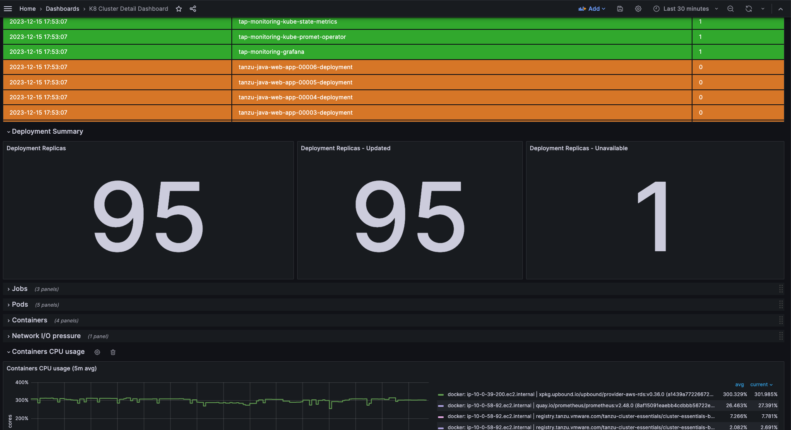
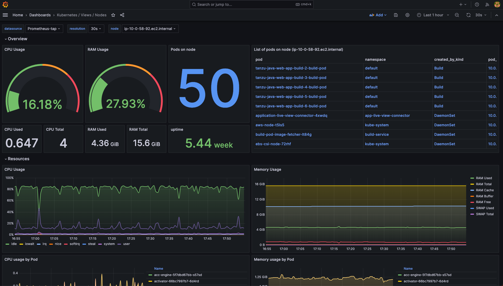
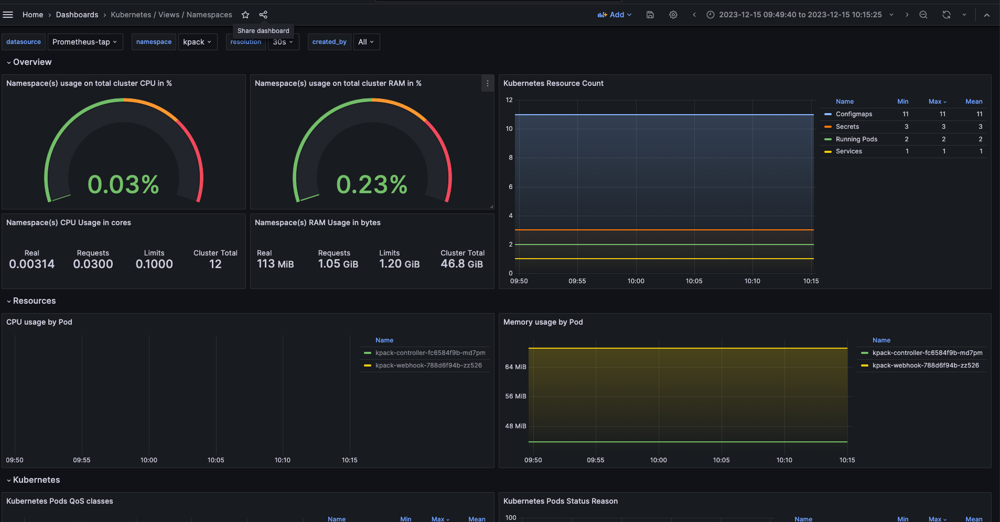

# Tanzu Application Platform non-saas monitoring with Prometheus and Grafana

This is a non saas monitoring solution using prometheus and grafana for TAP using the custom resource support in kube state metrics and grafana dashboards.

# Deployment Steps : 


1. [Prometheus Installation](#prom-installation)
1. [Grafana Installation](#grafana-installation)
1. [TAP PromQL query Samples](#PromQL-samples)
1. [Grafana Dashboards ](#grafana-dashboards)
1. [Integrate Grafana Dashboard in Tanzu Developer Portal](#grafana-dashboards-tdp)


### <a id="prom-installation"> Prometheus Installation


* Install helm package manager in your local machine terminal. 

* Prepare prometheus values file based on [this](prometheus-value.yaml) file and name it prometheus-values.yaml. This prometheus value file will fetch TAP components kube matrix resources and CRD's. 
 - You may want to update the ingress or LoadBalancer settings to match your TAP k8 environment.
 

 You can also refer to [this](https://github.com/vrabbi-tap/tap-kube-state-metrics) url for TAP kube-matrix-collector. 

* Execute following commands 

```
#Add the helm prometheus repo locally

helm repo add prometheus-community https://prometheus-community.github.io/helm-charts
helm repo update 

# Install the chart

helm upgrade --install tap-observability  prometheus-community/kube-prometheus-stack -n tap-monitoring --create-namespace -f prometheus-values.yaml

```

### <a id="grafana-installation">  Grafana Installation

* Prepare grafana values file based on [this](grafana-value.yaml) file and name it grafana-values.yaml
  - You may need to update the prometheus server url as per your url.

* Execute following commands 
```
kubectl create ns grafana

#Add grafana helm repo 
helm repo add grafana https://grafana.github.io/helm-charts
helm repo update

# Install the chart - set your grafana user and password in command

helm install grafana grafana/grafana \
    --namespace grafana \
    --set persistence.storageClassName="gp2" \
    --set persistence.enabled=true \
    --set adminPassword='secretpass' \
    --values  grafana-values.yaml \
    --set service.type=LoadBalancer


# You can get grafana userid and password using below command  

kubectl get secret --namespace grafana grafana -o jsonpath="{.data.admin-password}" | base64 --decode ; echo

```

#### <a id="PromQL-samples"> TAP PromQL query Samples 

The resource types and corresponding prometheus metrics being monitored are:


- **knative services** - knative_service_info, knative_service_status
- **knative revisions** - knative_revision_info, knative_revision_status
- **kapp controller package repositories** - carvel_packagerepository_info
- **kapp controller package installations** - carvel_packageinstall_info
- **kapp controller apps** - carvel_app_info, carvel_app_namespaces
- **api descriptors** - api_descriptor_info, api_descriptor_status
- **tekton pipeline runs** - tekton_pipeline_run_info, tekton_pipeline_run_status
- **tekton task runs** - tekton_task_run_info, tekton_task_run_status
- **accelerators** - accelerator_info, accelerator_imports_info, accelerator_status
- **workloads** - cartographer_workload_info , cartographer_workload_status
- **deliverables** - cartographer_deliverable_info , cartographer_deliverable_status
- **service bindings** - service_binding_info, service_binding_status
- **cluster instance** classes - stk_cluster_instance_class_composition_selector,             stk_cluster_instance_class_status
- **class claims** - stk_class_claim_info , stk_class_claim_status
- **resource claims** - stk_resource_claim_info, stk_resource_claim_status
- **image scans** - scst_image_scan_info, scst_image_scan_status
- **source scans** - scst_source_scan_info, scst_source_scan_status
- **kpack images** - kpack_image_info, kpack_image_status
- **kpack builds** - kpack_build_info, kpack_build_involved_buildpacks, kpack_build_status

#### TAP PromQL Query Samples 

```
#TAP PACKAGE INSTALLS IN GOOD STATE
carvel_packageinstall_info{namespace="tap-install",type="ReconcileSucceeded",status="True"}

# NUMBER OF SUCCESSFUL BUILD PER WORKLOAD - 
count by (id) (topk(1000, count by (id, workload) (kpack_build_involved_buildpacks)))

#NUMBER OF FAILED BUILDS PER WORKLOAD
count by (workload) (kpack_build_status{status="Failed", type="Succeeded"})

#SUCCESSFUL GIT SOURCE FOR A WORKLOAD
flux_git_repository_status{type="Ready",owner_type="Workload",component="source",status="True"}

#WORKLOADS WITHOUT A MATCHING SUPPLY CHAIN
cartographer_workload_status{type="SupplyChainReady",status="False"}

#NUMBER OF DELIVERABLES USING GIT AS SOURCE
count(cartographer_deliverable_info{source_image=""})

# WORKLOADS IN FAILED STATE
cartographer_workload_status{type="Ready",status="False"}

#DELIVERABLES IN FAILED STATE
cartographer_deliverable_status{type="Ready",status="False"}

#TAP PACKAGE REPOSITORIES IN GOOD STATE
carvel_packagerepository_info{namespace="tap-install",type="ReconcileSucceeded",status="True"}

#NUMBER OF CLASS CLAIM IN READY STATE
count(stk_class_claim_status{type="Ready",status="True"})

#KNATIVE SERVICES IN FAILED STATE
knative_service_status{status="False",type="Ready"}

#KNATIVE SERVICES WHERE LATEST REVISION IS NOT READY
knative_service_info unless ignoring(dst) (label_replace(knative_service_info, "dst", "$1", "latest_created_revision", "(.*)") == label_replace(knative_service_info, "dst", "$1", "latest_ready_revision", "(.*)"))

#NUMBER OF SERVICE BINDING PER TYPE OF SERVICE CLAIM
count by (service_kind) (service_binding_info)

#NUMBER OF SERVICE BINDING PER TYPE OF SERVICE CLAIM
count by (service_kind) (service_binding_info)

```


### <a id="grafana-dashboards"> Grafana Dashboards 

You can follow below steps to create some TAP K8 clusters dashboards 

* Create a prometheus datasource in your grafana and can import following dashboards 

    - TAP K8 Cluster Detail Dashboard - Import [TAP K8 Cluster Detail Dashboard Dashboard](./dashboards/K8_Cluster_Detail_Dashboard.json) file and select prometheus data source of your TAP K8 cluster. 

    

    - TAP K8 Node level Detail Dashboard  - Import [TAP K8 Node level Detail Dashboard](./dashboards/Kubernetes%20_%20Views%20_%20Nodes.json) file and select prometheus data source of your TAP K8 cluster. 

   

    - TAP K8 namespace level Dashboard   - Import [TAP K8 namespace level Dashboard ](./dashboards/Kubernetes%20_%20Views%20_%20Namespaces.json) file and select prometheus data source of your TAP K8 cluster. 

    

    Refer to [grafana dashboards](https://grafana.com/grafana/dashboards/) for various kind of dashboards samples. 

### <a id="grafana-dashboards-tdp"> Integrate Grafana Dashboard in Tanzu Developer Portal / TAP-Gui 
Please follow [steps](https://docs.vmware.com/en/VMware-Tanzu-Application-Platform/1.7/tap/tap-gui-plugins-valid-plugins-grafana.html) to integrate grafana plugin in Tanzu Developer Portal(TDP). 

